# Sallie's Point of Sales

## Deskripsi Proyek

Sallie's Point of Sales merupakan aplikasi Android yang dirancang untuk membantu proses penjualan pada toko atau usaha kecil. Aplikasi memungkinkan admin mengelola produk, cabang, transaksi, laporan, dan mencetak struk pembayaran secara langsung.

## Teknologi yang Digunakan

* Android Studio
* Kotlin
* Firebase Realtime Database
* Firebase Authentication

## Fitur Utama

### Manajemen Produk
* Tambah produk
* Edit produk
* Hapus produk
* Kelola stok produk

### Manajemen Cabang
* Tambah cabang
* Edit cabang
* Hapus cabang

### Transaksi Penjualan
* Pilih cabang
* Pilih produk
* Tambah ke keranjang
* Hitung total belanja otomatis
* Simpan transaksi

### Pembayaran
* Input nominal pembayaran
* Hitung kembalian
* Simpan data transaksi

### Laporan
* Riwayat transaksi
* Detail transaksi
* Rekap penjualan

### Akun
* Edit profil
* Ubah PIN

### Printer
* Pengaturan printer Bluetooth
* Cetak struk transaksi

## Screenshot Aplikasi

Berikut adalah tampilan antarmuka dari aplikasi Sallie's Point of Sales yang telah disusun secara rapi:

### 1. Autentikasi & Dashboard
| Register | Login | Dashboard |
| :---: | :---: | :---: |
| 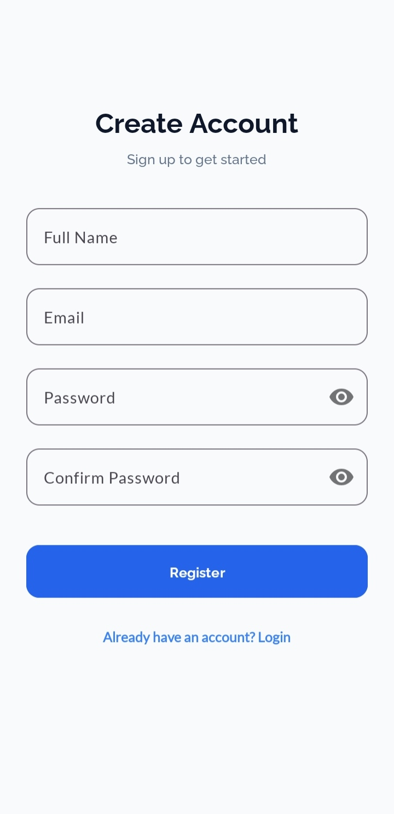 | 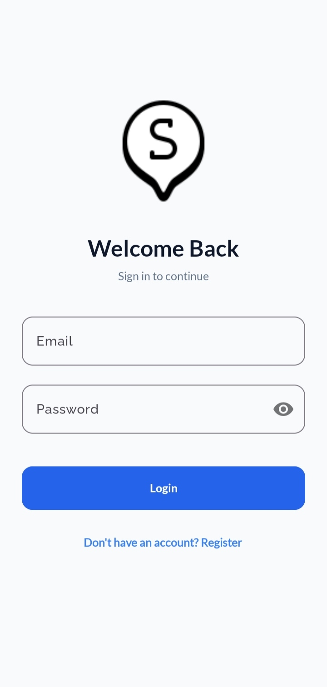 | 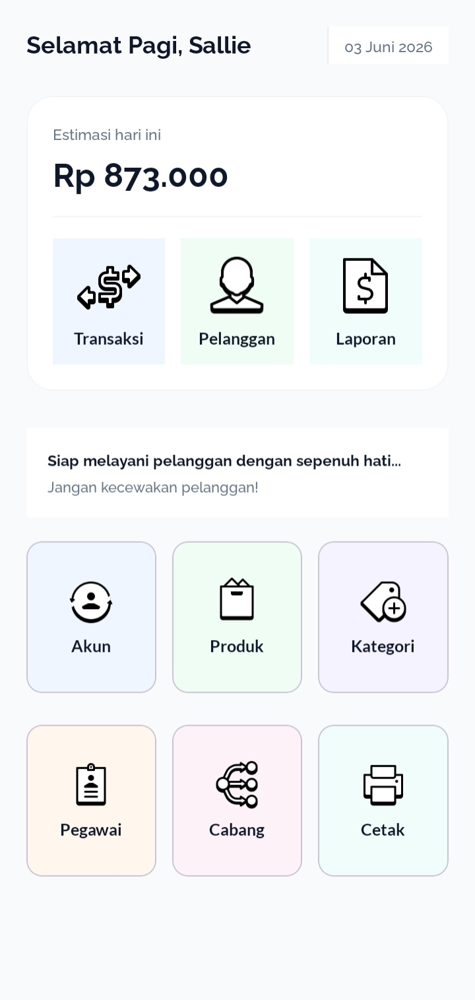 |

### 2. Manajemen Data Master
| Kategori | Tambah Kategori | Cabang | Tambah Cabang |
| :---: | :---: | :---: | :---: |
| 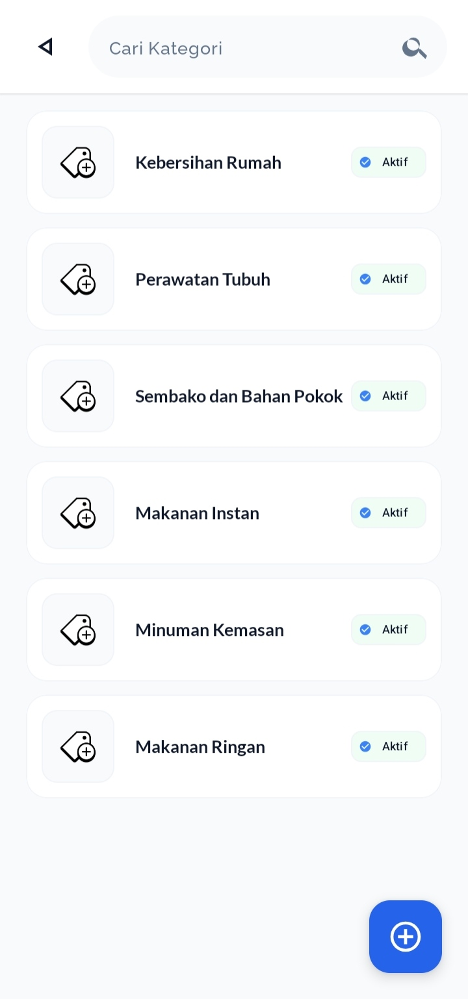 | 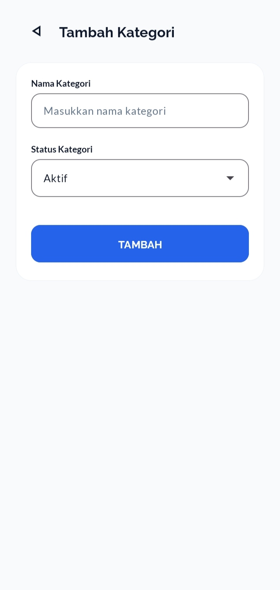 | 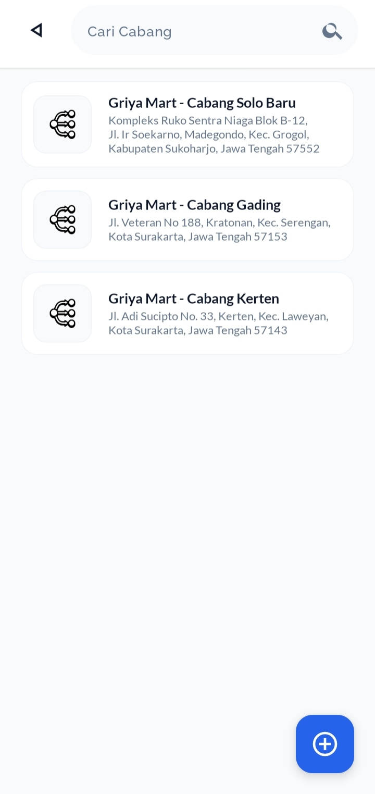 | 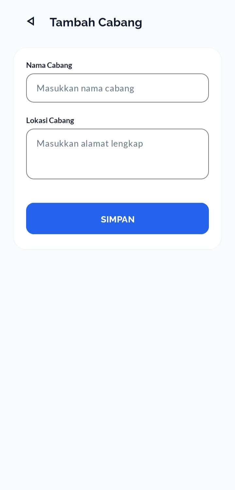 |

| Pegawai | Tambah Pegawai | Pelanggan | Tambah Pelanggan |
| :---: | :---: | :---: | :---: |
|  | 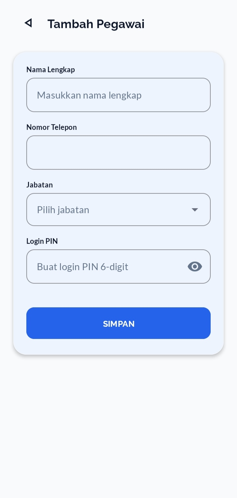 |  | 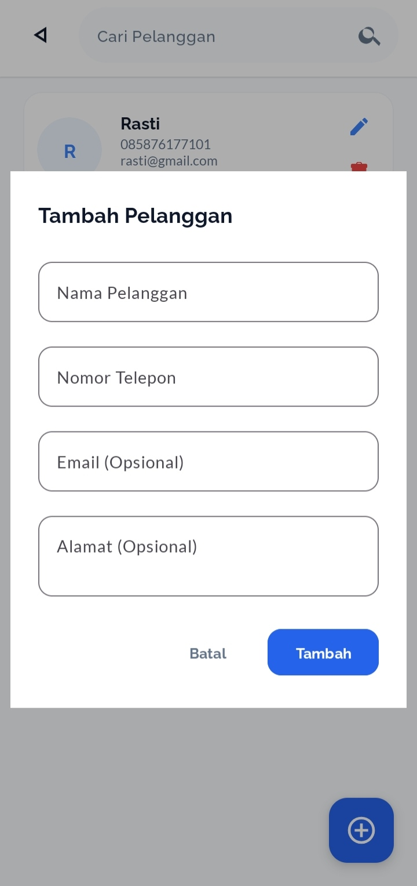 |

### 3. Produk & Transaksi Penjualan
| Produk | Tambah Produk | Transaksi | Pembayaran |
| :---: | :---: | :---: | :---: |
| 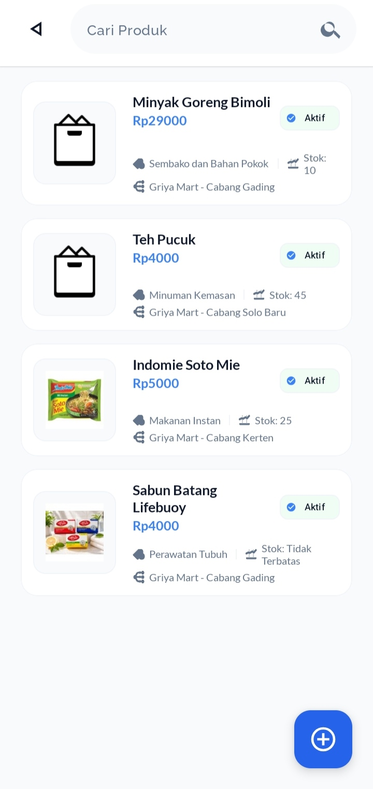 | 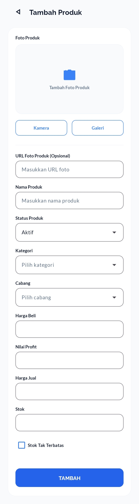 | 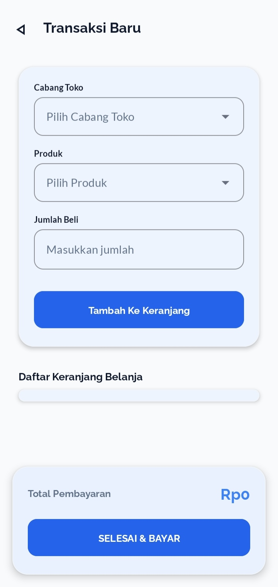 | 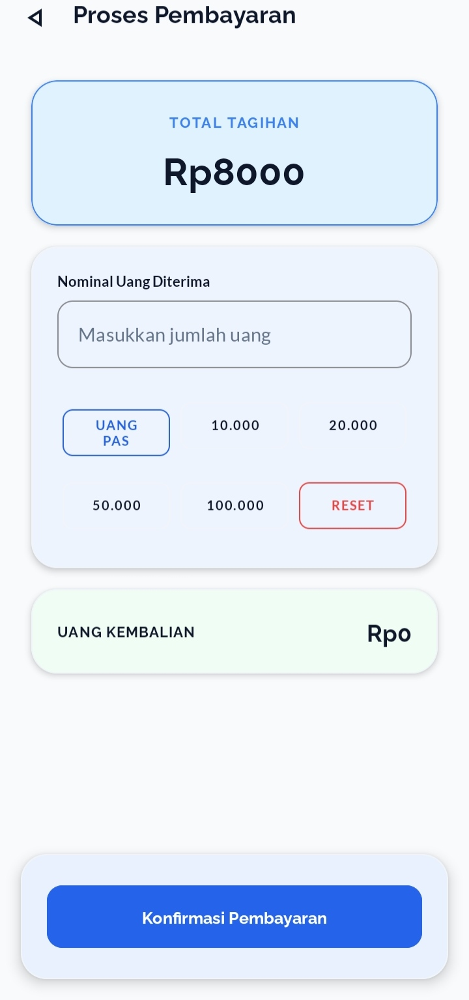 |

### 4. Fitur Pendukung & Laporan
| Struk Nota | Laporan | Akun | Pengaturan Printer |
| :---: | :---: | :---: | :---: |
| 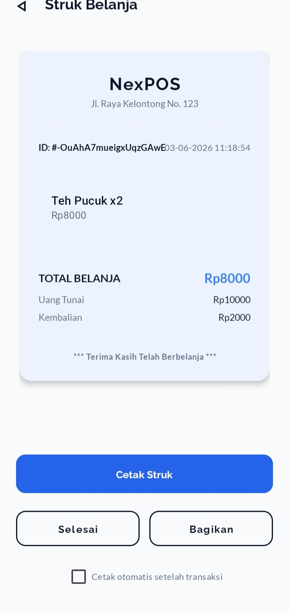 | 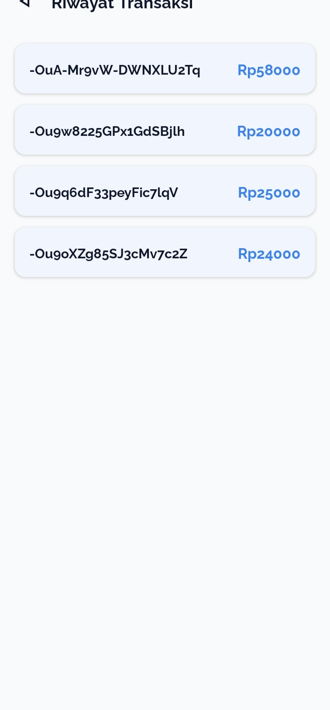 | 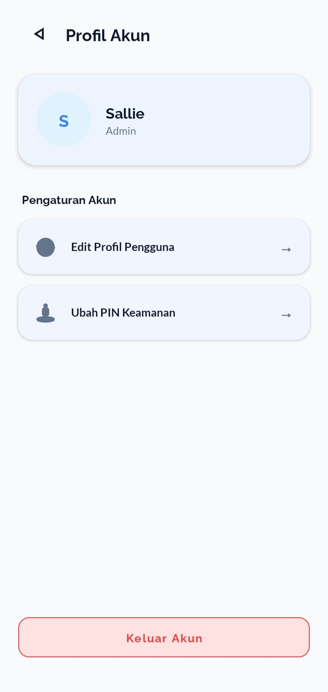 | 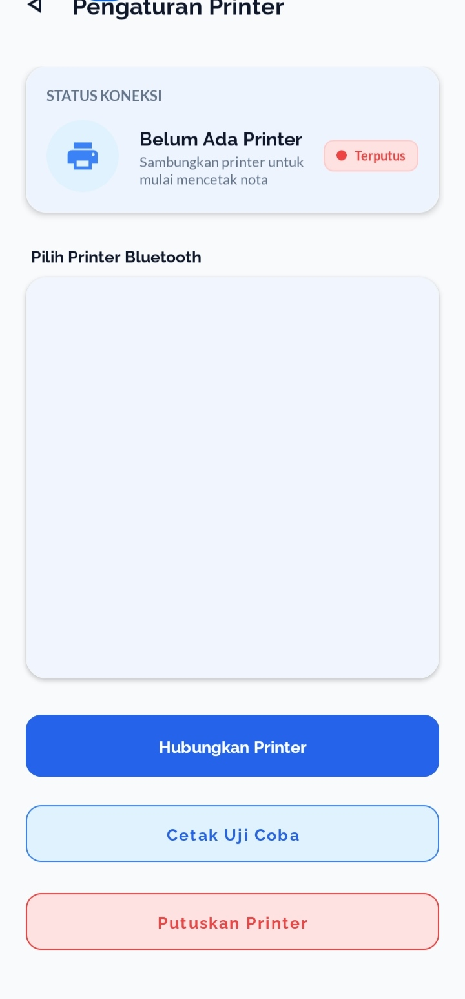 |

## Struktur Database Firebase

Berikut adalah tabel pemetaan data yang digunakan di dalam Firebase Realtime Database:

### 1. User / Pegawai
| Field | Tipe | Keterangan |
| :--- | :--- | :--- |
| uid | String | ID Unik User (dari Firebase Auth) |
| nama | String | Nama lengkap pengguna |
| email | String | Alamat email |
| role | String | Tingkatan hak akses (Admin/Pegawai) |

### 2. Cabang
| Field | Tipe | Keterangan |
| :--- | :--- | :--- |
| idCabang | String | ID Unik Cabang |
| namaCabang | String | Nama cabang toko |

### 3. Kategori
| Field | Tipe | Keterangan |
| :--- | :--- | :--- |
| idKategori | String | ID Unik Kategori |
| namaKategori | String | Nama kategori produk |

### 4. Pelanggan
| Field | Tipe | Keterangan |
| :--- | :--- | :--- |
| idPelanggan | String | ID Unik Pelanggan |
| namaPelanggan | String | Nama lengkap pelanggan |
| noTelepon | String | Nomor telepon aktif |

### 5. Produk
| Field | Tipe | Keterangan |
| :--- | :--- | :--- |
| idProduk | String | ID Unik Produk |
| namaProduk | String | Nama barang / produk |
| hargaProduk | Int | Harga jual produk |
| stokProduk | Int | Sisa stok yang tersedia |
| idCabang | String | Relasi ke ID Cabang tempat produk berada |
| idKategori | String | Relasi ke ID Kategori produk |

### 6. Transaksi
| Field | Tipe | Keterangan |
| :--- | :--- | :--- |
| idTransaksi | String | ID Unik Transaksi |
| tanggal | String | Waktu transaksi dilakukan |
| idCabang | String | ID Cabang tempat transaksi |
| namaCabang | String | Nama cabang saat transaksi |
| totalBayar | Int | Total belanja keseluruhan |
| itemDibeli | Map / List | Daftar ID produk beserta jumlah yang dibeli |

## Cara Menjalankan

Ikuti langkah-langkah berikut untuk menjalankan proyek aplikasi ini di komputer/perangkat lokal Anda:

### 1. Prasyarat (Prerequisites)
Sebelum memulai, pastikan Anda telah memasang perangkat lunak berikut:
* **Android Studio** (Versi Dolphin / Flamingo / versi terbaru sangat disarankan).
* **Java Development Kit (JDK)** versi 11 atau yang lebih baru.
* Perangkat Android fisik dengan fitur Bluetooth aktif (untuk uji coba cetak struk) atau **Emulator Android**.

### 2. Kloning Repositori (Clone Repository)
Unduh kode sumber proyek ini menggunakan Git melalui Terminal atau Command Prompt:
```bash
git clone [https://github.com/username/pointofsales.git](https://github.com/username/pointofsales.git)
